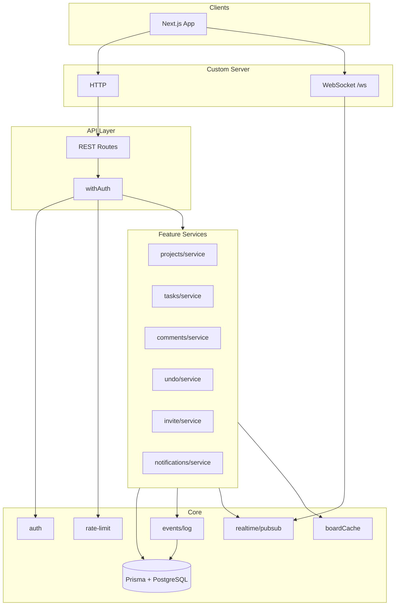
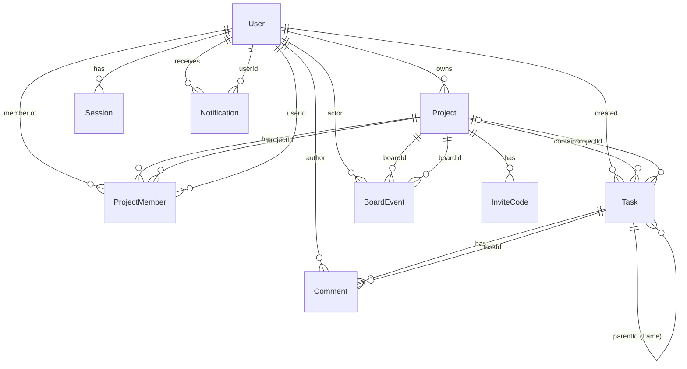
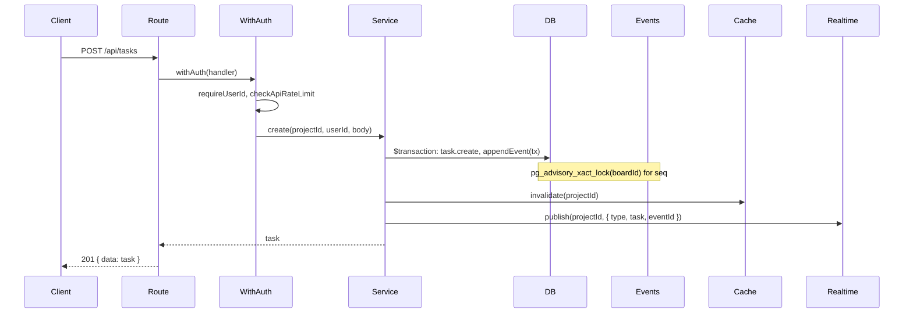

# HappyRobot — Backend Architecture

High-level design doc for the backend: data model, API surface, core services, and how they fit together.

---

## 1. Overview

- **REST:** Next.js App Router API routes under `src/app/api/`. All protected routes use `withAuth` (session + API rate limit), then call feature services.
- **Realtime:** Custom Node server (`src/server/index.ts`) runs HTTP + WebSocket. HTTP is forwarded to Next.js; `/ws?boardId=<id>` is handled by the server (session from cookie, project membership check). WS clients are subscribed to in-memory pub/sub; services call `publish(boardId, payload)` after DB writes so all subscribers get the same event.

---

## 2. Database schema (high level)

| Model | Purpose |
|-------|--------|
| **User, Account, Session, VerificationToken** | NextAuth (Google); sessions in DB. |
| **Project** | Board; `metadata` (JSON) for layers etc. |
| **ProjectMember** | Access control; one row per user per project. |
| **InviteCode** | Share link; `code` unique, optional `expiresAt`. |
| **Task** | Canvas item; `configuration` (JSON: type, position, size, contentHtml, …), `dependencies` (connector endpoints), `parentId` (frame). |
| **Comment** | Thread on a task; optional `positionX/Y`, `mentionUserIds` (JSON). |
| **Notification** | In-app; e.g. comment mention. |
| **BoardEvent** | Event log per board; `(boardId, seq)` unique, used for undo/redo and sync. |

---

## 3. Database indexing strategy

| Table | Indexes / constraints | Rationale |
|-------|----------------------|-----------|
| **Project** | `@@index([ownerId])` | List projects by owner. |
| **ProjectMember** | `@@unique([projectId, userId])`, `@@index([userId])`, `@@index([projectId])` | Membership checks and “my projects” by user. |
| **InviteCode** | `@@unique([code])`, `@@index([projectId])` | Lookup by code; list by project. |
| **Task** | `@@index([projectId])`, `@@index([projectId, status])`, `@@index([projectId, updatedAt])`, `@@index([parentId])` | List by project; pagination by `updatedAt`; frame children. |
| **Comment** | `@@index([taskId])`, `@@index([taskId, createdAt])` | Comments by task; ordering by time. |
| **Notification** | `@@index([userId])`, `@@index([userId, read])` | Unread list per user. |
| **BoardEvent** | `@@unique([boardId, seq])`, `@@index([boardId, seq])` | Sequential event log; range reads for sync/undo. |

No GIN on JSON; bounds-based task fetch uses raw SQL with `configuration->'position'` (indexed only if you add expression indexes later).

---

## 4. API endpoints

| Area | Method | Path | Purpose |
|------|--------|------|---------|
| **Auth** | GET/POST | `/api/auth/[...nextauth]` | NextAuth (sign-in, session, providers). |
| **Projects** | GET, POST | `/api/projects` | List mine; create. |
| | GET, PATCH, DELETE | `/api/projects/[id]` | Get/update/delete; membership enforced. |
| | GET | `/api/projects/[id]/members` | List members. |
| **Tasks** | GET, POST | `/api/tasks` | List by `projectId` (cursor or bounds); create. |
| | GET, PATCH, DELETE | `/api/tasks/[id]` | Get/update/delete. |
| | PATCH | `/api/tasks/bulk` | Bulk config updates. |
| **Comments** | GET, POST | `/api/comments` | List by `taskId`; create. |
| | GET, PATCH, DELETE | `/api/comments/[id]` | Get/update/delete. |
| | GET | `/api/comments/summary` | Summary by project (counts, latest position). |
| **Events** | GET | `/api/events` | Event log: `boardId`, `afterSeq`, `limit` (cached). |
| | POST | `/api/events/undo` | Undo by `eventId`. |
| | POST | `/api/events/redo` | Redo by `eventId`. |
| **Invite** | POST | `/api/invite/create` | Create code for project. |
| | POST | `/api/invite/join` | Join by code. |
| **Notifications** | GET | `/api/notifications` | List; filter by read. |
| | PATCH | `/api/notifications/[id]` | Mark read. |
| | POST | `/api/notifications/read-all` | Mark all read. |
| **OpenAPI** | GET | `/api/openapi` | OpenAPI spec. |

Protected routes use `withAuth`: resolve session → 401 if missing; check API rate limit → 429 if over; then run handler with `userId`.

---

## 5. Request flow (typical write path)

- Writes run in a Prisma transaction where needed (e.g. task + event).
- **Board events:** `appendEvent(tx, …)` uses a per-board advisory lock so `(boardId, seq)` stays unique under concurrency.
- After commit: cache invalidation for that board; `publish` so WS subscribers get the event.

---

## 6. Code structure

| Layer | Path | Role |
|-------|------|------|
| **API** | `src/app/api/**/route.ts` | HTTP handlers; `withAuth`; validate input (Zod); call feature services; return `jsonSuccess` / `jsonError`. |
| **Feature services** | `src/features/<feature>/service.ts` | Domain logic; use `db`, `appendEvent`, `publish`, `boardCache`. |
| **Core** | `src/core/` | Shared infra: `auth`, `db`, `events` (log + advisory lock), `realtime` (pub/sub), `cache`, `rate-limit` (API + WS). |
| **Shared** | `src/shared/` | Constants, types, Zod schemas. |

No business logic in route files; no circular dependency from core to features.

---

## 7. Performance optimizations

- **Event log:** GET `/api/events` uses an in-memory **board cache** (key `events:boardId:afterSeq:limit`, TTL 60s). Invalidation on any write to that board.
- **Tasks list:** Two modes: (1) **Cursor pagination** by `updatedAt` (indexed); (2) **Bounds-based** via raw SQL on `configuration->'position'` for viewport, plus connector filter; cap 500.
- **Rate limiting:** Per-user API (e.g. 60/min); per-connection WS (e.g. 30 msgs); avoids burst abuse.
- **Session:** DB session; cookie lookup once per request; optional future: short-lived JWT for API-only clients.

---

## 8. Scalability and modularity

- **Single-process:** In-memory pub/sub and cache; one Node server. To scale horizontally you’d replace pub/sub with Redis (or similar) and cache with a shared store.
- **Modular features:** Each feature is a folder (service, schemas, types); API routes and WS handling depend on services, not the reverse.
- **Event log:** Append-only `BoardEvent` with sequential `seq` per board; undo/redo and sync are event-driven and can be replayed or extended without changing write path.

---

## 9. Lazy loading and pagination

- **Tasks:** `GET /api/tasks?projectId=…&cursor=…&limit=…` returns `{ items, nextCursor }`. Client requests next page with `cursor=nextCursor`. Index `[projectId, updatedAt]` supports efficient cursor pagination.
- **Tasks by viewport:** `GET /api/tasks?projectId=…&minX&minY&maxX&maxY` returns only tasks in bounds (and connectors between them); frontend uses this when the viewport changes (debounced).
- **Events:** `GET /api/events?boardId=…&afterSeq=…&limit=…` for sync/replay; responses cached per `(boardId, afterSeq, limit)`.

---

## 10. Load behavior (observed)

- **k6:** GET `/api/projects` and GET `/api/tasks?projectId=…` at ~10 iters/s, 10 VUs: p95 latency ~18–20 ms, no timeouts. Rate limit and auth (401) dominate “failure” metrics when unauthenticated; with valid session, 200s and thresholds pass.
- **Bottlenecks to watch:** DB connection pool under many concurrent writes; advisory lock contention on the same board; cache size if many boards are hot.

---

*You can append more sections below (e.g. security, observability, deployment) as needed.*
