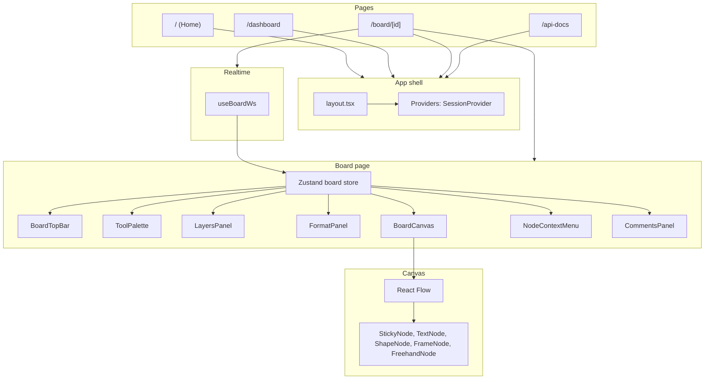

# HappyRobot — Frontend Architecture

High-level guide to the client: pages, features, canvas, state, and realtime.

---

## 1. Overview

- **Stack:** Next.js 16 (App Router), React 19, Zustand, NextAuth (SessionProvider), @xyflow/react (canvas), Tailwind, shadcn/ui (Radix), Sonner (toast).
- **Entry:** Root layout wraps app with fonts, TooltipProvider, Providers (SessionProvider), Toaster. All data fetching and board state live in client components or hooks.

---

## 2. Pages

| Route | File | Purpose |
|-------|------|--------|
| **/** | `src/app/page.tsx` | Home. If unauthenticated: “Collaborative whiteboard” + “Sign in with Google”. If authenticated: “You’re signed in” + “Go to Dashboard”. Uses `useSession`, `signIn("google", { callbackUrl: "/dashboard" })`. |
| **/dashboard** | `src/app/dashboard/page.tsx` | Requires auth (`useRequireAuth`). Header: logo, “Join with code”, “New board”. Main: list of projects (cards with `BoardCardPreview` + name/description) or empty state. Dialogs: `NewBoardDialog`, `JoinByCodeDialog`. Data: `useProjects()` → `fetchProjects`, `createProject`, `joinByCode`. |
| **/board/[id]** | `src/app/board/[id]/page.tsx` | Main whiteboard. Requires auth. Loads project + tasks (and comment summary), subscribes to WebSocket (`useBoardWs`), registers window callbacks for node save/resize, viewport-based task fetch (debounced), pane click (create tool), freehand stroke end, context menu, delete, copy/paste/duplicate, undo keyboard. Renders: `BoardTopBar`, `ToolPalette`, `LayersPanel`, `FormatPanel`, `BoardCanvas`, `NodeContextMenu`, `FindReplaceDialog`, `CommentsPanel`. |
| **/api-docs** | `src/app/api-docs/page.tsx` | Swagger UI for OpenAPI spec (e.g. from `/api/openapi`). |

---

## 3. App shell and auth

- **Layout** (`src/app/layout.tsx`): Geist fonts, TooltipProvider, `Providers`, Toaster, `globals.css`.
- **Providers** (`src/app/providers.tsx`): `SessionProvider` (NextAuth) with `refetchInterval={0}`, `refetchOnWindowFocus={false}`.
- **Auth guard:** `useRequireAuth()` (in `src/features/auth/use-require-auth.ts`) uses `useSession`; if unauthenticated redirects to `/api/auth/signin?callbackUrl=...`. Used on dashboard and board.

---

## 4. Board store (Zustand)

**File:** `src/features/board/board-store.ts`

Single store for the active board. Key state:

- **Project and flow:** `project`, `nodes`, `edges`, `activeTool`, `layers`, `nodeLayerId`, `activeLayerId`.
- **Collaboration:** `presence`, `cursors`, `commentsByTask`, `commentCountByTaskId`, `commentPositionByTaskId`, `openCommentTaskId`, `commentsPanelOpen`.
- **Undo/redo:** `lastEventId`, `redoStack`.
- **UI:** `focusStickyId`, `clipboard`, `showMinimap`.

**Core actions:**

- `applyTasksToFlow(tasks)` — Maps tasks to React Flow nodes/edges via `tasksToNodesAndEdges` (sticky, shape, frame, text, freehand, connector → edges), sets `nodes`, `edges`, `nodeLayerId`.
- `addOrUpdateTask(task)` / `removeTask(taskId)` — Update nodes/edges by task id; used by API responses and WebSocket.
- `setNodes` / `setEdges` — Used by canvas `onNodesChange` / `onEdgesChange`.
- Presence/cursor/comment setters; `setClipboard`; `pushRedo` / `popRedo` / `clearRedoStack`; `reset()` for board switch.

Layers come from `project.metadata.layers` or default `[{ id: "default", name: "Default", visible: true, order: 0 }]`.

---

## 5. Tool registry and palette

**File:** `src/features/board/tool-registry.ts`

- **Categories:** `select` (Select/drag, Pan), `connect` (Connector), `create` (all node-creating tools).
- **Create tools:** Sticky note, Frame, Rectangle, Circle, Arrow, Diamond, Parallelogram, Triangle, Rounded rectangle, Document, Ellipse, Line, Text, Freehand. Each has `id`, `label`, `icon`, `nodeType` (sticky | shape | frame | text | freehand), optional `shape` (for shapes), `defaultSize`, `defaultTitle`.
- **Helpers:** `getToolDef`, `isCreateTool`, `isConnectTool`, `getTaskTypeFromNode` (for mapping node → backend `configuration.type`), `ALLOWED_TASK_TYPES`.

**Tool palette** (`src/features/board/tool-palette.tsx`): Renders tools grouped by category; highlights `activeTool`; buttons call `setActiveTool`. Used on board page.

---

## 6. Canvas (React Flow)

**File:** `src/features/canvas/board-canvas.tsx`

- **Library:** @xyflow/react. Nodes/edges from store; layer visibility applied (nodes with `nodeLayerId` in a hidden layer get `hidden`; edges whose source/target are hidden are filtered out).
- **Node types:** `sticky` (StickyNode), `text` (TextNode), `shape` (ShapeNode), `frame` (FrameNode), `freehand` (FreehandNode). Registered in `nodeTypes`.
- **Behavior:** `onNodesChange` / `onEdgesChange` → `applyNodeChanges` / `applyEdgeChanges` → `setNodes` / `setEdges`. `onPaneClick` only when a create tool is active (and not freehand) → converts screen to flow coords and calls `onCanvasClick`. `onConnect` when connector tool → creates connector task via API. `onNodeDragStop` → batched PATCH bulk position/size. `onDelete` → delete selected nodes/edges via API. Pan/zoom when select or pan tool; nodes draggable only in select mode; elements selectable only in select mode.
- **Extras:** Background (dots), Controls, MiniMap (toggle from top bar), `FlowPositionRefSetterPanel` (exposes `screenToFlowPosition` for click/stroke coords), `CursorOverlay` (other users’ cursors from store), freehand overlay when tool is freehand.

**use-board-canvas:** `handlePaneClick` (screen → flow, then `onCanvasClick`), `handleNodeDragStop` (batch updates, then bulk PATCH), `handleConnect` (POST task with type connector + dependencies).

**Node persistence:** Sticky/text/shape/frame/freehand save and resize are wired via `window.__onStickySave`, `__onStickyResize`, `__onTextSave`, `__onTextResize`, `__onShapeResize`, `__onFrameResize`, `__onFormatChange`. Board page sets these and uses `getDebouncedTaskPatch` to send PATCH to `/api/tasks/[id]` or bulk; on success, `addOrUpdateTask` and optionally `clearRedoStack`.

---

## 7. Board UI (top bar, panels, context menu)

- **BoardTopBar** (`src/features/board/board-top-bar.tsx`): Board name, Rename (owner only), Comments button (with count), Notifications dropdown, Find and replace, Minimap toggle, Share dialog, Presence popover (“Who’s here”), User avatar menu (Sign out).
- **LayersPanel:** List of layers (visibility toggle, active layer selection). “Move selection to layer” when nodes selected; PATCH task config with `layerId` and project metadata with layers.
- **FormatPanel:** Shown when at least one node selected. Sticky: sticky color presets. Shapes: fill/stroke presets; single shape: rotation slider. Updates store and calls `__onFormatChange` (bulk PATCH).
- **NodeContextMenu:** Right-click on node/edge. Actions: Edit (focus sticky), Copy, Paste, Duplicate, Comment, Delete. Wired from board page with `copySelection`, `paste`, `duplicate`, `canPaste` from `useCopyPasteDuplicate`.
- **FindReplaceDialog:** Find/replace in node labels and sticky contentHtml; navigates matches, updates store and PATCHes tasks.
- **useCopyPasteDuplicate:** Copy selection to store clipboard; Paste/Duplicate create new tasks via POST (nodes then connectors), with offset for paste; Cmd/Ctrl+C/V/D bound.

---

## 8. Realtime (WebSocket)

**File:** `src/features/realtime/use-board-ws.ts`

- **Connection:** `ws://origin/ws?boardId=<id>`. Reconnect on close with backoff.
- **Incoming:** Parses JSON. `task.created` / `task.updated` → `addOrUpdateTask`; `task.deleted` → `removeTask`; `project.updated` → `setProject`; comment events → comment store updates; `presence.join` / `presence.leave` → presence; `cursor` → `setCursor`; `undo` → apply undo result (e.g. task_deleted, task_restored, comment updates). Optional callbacks `onTaskUpserted`, `onTaskRemoved` (e.g. update local task cache).
- **Outgoing:** Board page sends `{ type: "cursor", x, y }` on pane mouse move (throttled). Ping/pong handled by server.
- **Store:** All live updates go through the same Zustand store so the canvas and UI stay in sync.

---

## 9. Undo and redo

**File:** `src/features/undo/use-undo-keyboard.ts`

- **Shortcuts:** Cmd/Ctrl+Z → undo; Cmd/Ctrl+Shift+Z → redo.
- **Undo:** Uses `lastEventId` from store; pushes it to `redoStack`, then POST `/api/events/undo` with `{ eventId }`. Server performs undo and broadcasts; client applies same undo result via WebSocket (or refetches task for restores).
- **Redo:** Pops `eventId` from `redoStack`, POST `/api/events/redo` with `{ eventId }`. Server re-applies; client gets updates via WS.
- **Clear redo:** After local mutations (e.g. sticky save, drag), board page calls `clearRedoStack()` so redo stack matches server.

---

## 10. Comments

- **CommentsPanel** (`src/features/comments/comments-panel.tsx`): Sheet; task list (by comment count) and thread for `openCommentTaskId`. Loads comments with `apiGet(/api/comments?taskId=…)`, members for @-mentions. Add comment (with optional mentions) via POST; resolve/toggle; edit/delete. Store: `commentsByTask`, `setCommentsForTask`, `addOrUpdateComment`, etc.
- **CommentPin:** Shown on sticky (and other nodes as needed); opens panel and focuses that task. Positions from `commentPositionByTaskId` or defaults.
- **Counts:** Board page loads `/api/comments/summary?projectId=…` and sets `commentCountByTaskId`, `commentPositionByTaskId`; top bar shows total count; WebSocket keeps counts in sync when comments change.

---

## 11. Invite and share

- **ShareDialog** (`src/features/invite/share-dialog.tsx`): Owner only. On open, POST `/api/invite/create` with `projectId` to get or create code. Shows code and “Copy link” / “Copy code”. Link format: `/dashboard?join=<code>`.
- **Join by code:** Dashboard “Join with code” opens `JoinByCodeDialog`; user enters code; POST `/api/invite/join`; on success redirect to `board/${result.project.id}`. New board: `NewBoardDialog` → POST `/api/projects` → redirect to new board.

---

## 12. Notifications and presence

- **NotificationsDropdown** (`src/features/notifications/notifications-dropdown.tsx`): Fetches `/api/notifications` when opened (and once on mount for badge). List with mark read (PATCH by id) and “Mark all read”. Can open comment thread via `onOpenCommentTask(taskId)`.
- **PresencePopover** (`src/features/presence/presence-popover.tsx`): “Who’s here (N)” from store `presence`; lists avatars/names. Presence comes from WebSocket `presence.join` / `presence.leave`.
- **CursorOverlay** (`src/features/cursors/cursor-overlay.tsx`): Renders other users’ cursors from store `cursors`; uses React Flow `flowToScreenPosition` to place avatars + names on screen.

---

## 13. Projects (dashboard data and previews)

- **useProjects** (`src/features/projects/use-projects.ts`): `projects`, `loading`, `error`, `fetchProjects()` (GET /api/projects), `createProject(name)` (POST), `joinByCode(code)` (POST invite/join). Used by dashboard.
- **BoardCardPreview** (`src/features/projects/board-card-preview.tsx`): Fetches tasks for a project (GET /api/tasks?projectId=…&limit=100), computes bounding boxes from task configuration (position/size/type), fits and scales into a fixed SVG viewBox, draws rects by type (sticky, frame, text, freehand, shapes). Shown on dashboard cards.

---

## 14. Data flow (board page)

1. **Mount:** `boardId` from route; auth required. Load project (GET `/api/projects/[id]`) and tasks (GET `/api/tasks?projectId=…&limit=100`). Apply tasks to flow; load comment summary; set comment counts/positions.
2. **Viewport:** On pan/zoom, debounced handler computes bounds (viewport + padding in flow coords), GET `/api/tasks?projectId=…&minX&minY&maxX&maxY`, merges into local task cache, applies in-bounds tasks to flow (so only visible-area tasks are in the store for large boards).
3. **Create (pane click):** Temp node added to store; POST `/api/tasks` with type/size/position; on success replace temp with real task and switch to select tool.
4. **Writes (sticky/shape/frame/text resize or content):** Window callbacks call debounced PATCH (or bulk PATCH for format); on success `addOrUpdateTask` and `clearRedoStack`.
5. **Realtime:** WebSocket messages update the same store; all clients see the same state.

---

## 15. File map (features and lib)

| Area | Path | Role |
|------|------|------|
| **Board** | `src/features/board/` | `board-store`, `tool-registry`, `tool-palette`, `board-top-bar`, `layers-panel`, `format-panel`, `node-context-menu`, `find-replace-dialog`, `use-copy-paste` |
| **Canvas** | `src/features/canvas/` | `board-canvas`, `use-board-canvas`, `sticky-node`, `text-node`, `freehand-node`, `freehand-overlay`, `use-freehand-draw`, `flow-position-ref` |
| **Shapes / Frames** | `src/features/shapes/`, `src/features/frames/` | `shape-node`, `frame-node` |
| **Realtime** | `src/features/realtime/` | `use-board-ws` |
| **Undo** | `src/features/undo/` | `use-undo-keyboard` |
| **Comments** | `src/features/comments/` | `comments-panel`, `comment-pin`, service/types/schemas |
| **Invite** | `src/features/invite/` | `share-dialog`, service/schemas/types |
| **Notifications** | `src/features/notifications/` | `notifications-dropdown`, service |
| **Presence / Cursors** | `src/features/presence/`, `src/features/cursors/` | `presence-popover`, `cursor-overlay` |
| **Projects** | `src/features/projects/` | `use-projects`, `new-board-dialog`, `join-by-code-dialog`, `board-card-preview` |
| **Auth** | `src/features/auth/` | `use-require-auth` |
| **Client lib** | `src/lib/` | `api` (apiGet, apiPost, apiPatch, apiDelete), `debounced-task-patch`, `utils` (cn) |
| **UI** | `src/components/ui/` | Button, Input, Dialog, Sheet, Dropdown, Avatar, Tooltip, etc. (shadcn) |

---

*You can extend this doc with more detail (e.g. per-node props, error handling, or accessibility) in the same file.*
