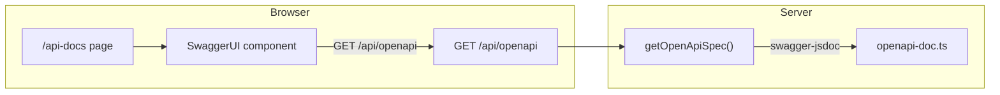

# HappyRobot — Swagger / OpenAPI API Docs

This document describes the API documentation UI and how the OpenAPI spec is built and served.

---

## 1. Overview

HappyRobot exposes interactive API documentation via **Swagger UI** at `/api-docs`. The spec is **OpenAPI 3.0.3**, generated at runtime from JSDoc-style `@openapi` blocks in a single source file. The UI is a client-side React component that fetches the spec from `/api/openapi` and renders it with `swagger-ui-react`.

**User flow:** Open `/api-docs` in the browser → page loads → fetches `/api/openapi` (JSON) → Swagger UI renders the spec → users can expand endpoints, see request/response schemas, and try requests (with cookies for auth).

---

## 2. Architecture



- **Page:** Next.js App Router page at `src/app/api-docs/page.tsx`; renders `SwaggerUI` and sets metadata.
- **SwaggerUI:** Client component that fetches the spec and renders `swagger-ui-react` with `spec={spec}`.
- **GET /api/openapi:** Next.js route that returns `getOpenApiSpec()` as JSON.
- **getOpenApiSpec():** Uses `swagger-jsdoc` to scan `src/lib/openapi-doc.ts` for `@openapi` blocks and merge them with a base definition.
- **openapi-doc.ts:** Single file containing all path definitions as JSDoc comments; no separate YAML/JSON file.

---

## 3. File structure

| File | Purpose |
|------|---------|
| `src/app/api-docs/page.tsx` | Next.js page; metadata (title, description) and wrapper for Swagger UI. |
| `src/app/api-docs/swagger-ui.tsx` | Client component: dynamic import of `swagger-ui-react`, fetch of `/api/openapi`, loading state, render of `<SwaggerUIBundle spec={spec} />`. |
| `src/app/api/openapi/route.ts` | API route: `GET` returns `NextResponse.json(getOpenApiSpec())`. |
| `src/lib/swagger.ts` | Builds the OpenAPI spec: base definition (info, servers, security) + `swagger-jsdoc` options; exports `getOpenApiSpec()`. |
| `src/lib/openapi-doc.ts` | Single source of path documentation: JSDoc blocks with `@openapi` and YAML-style path/method/request/response. |

**Dependencies (from package.json):**

- `swagger-jsdoc` — scans source for `@openapi` and produces an OpenAPI object.
- `swagger-ui-react` — React component that renders Swagger UI (and its CSS).

---

## 4. Base spec (swagger.ts)

The base definition in `src/lib/swagger.ts` defines:

- **openapi:** `3.0.3`
- **info:** title "HappyRobot API", version "1.0.0", short description.
- **servers:** `[{ url: "/", description: "Current origin" }]` — requests in Swagger UI are sent relative to the same origin (the app).
- **security:** Global `[{ sessionAuth: [] }]`.
- **components.securitySchemes.sessionAuth:**
  - `type: "apiKey"`
  - `in: "cookie"`
  - `name: "next-auth.session-token"`
  - Description explains that the user must be signed in via the app; the browser sends the session cookie with requests.

The `apis` option for swagger-jsdoc points to the single file:

```ts
apis: [path.join(process.cwd(), "src/lib/openapi-doc.ts")]
```

So all path definitions are read from that file. The result of `swaggerJsdoc(options)` is returned as the OpenAPI spec (typed as `Record<string, unknown>`).

---

## 5. Path documentation (openapi-doc.ts)

Every endpoint is documented with a JSDoc block that starts with `@openapi` and contains a YAML fragment. Structure:

```yaml
@openapi
/api/some/path:
  get:
    summary: ...
    tags: [TagName]
    security: [sessionAuth: []]
    parameters: ...
    responses: ...
  post:
    ...
```

Conventions used in this project:

- **Paths:** All under `/api/...` (e.g. `/api/projects`, `/api/projects/{id}`, `/api/tasks`, `/api/comments`, `/api/events`, `/api/notifications`, `/api/invite/create`, `/api/invite/join`).
- **Tags:** Group endpoints (Projects, Tasks, Comments, Events, Notifications, Invite).
- **Security:** Each operation uses `security: [sessionAuth: []]` (session cookie).
- **Responses:** Document 200/201, 400, 401, 404 (and others where applicable). Descriptions are short (e.g. "Unauthorized", "Not found").
- **Request bodies:** For POST/PATCH, `requestBody.content.application/json.schema` with `type: object`, `required`, and `properties`.

**Documented route groups:**

| Tag | Paths |
|-----|--------|
| Projects | `GET/POST /api/projects`, `GET/PATCH/DELETE /api/projects/{id}`, `GET /api/projects/{id}/members` |
| Tasks | `GET/POST /api/tasks`, `GET/PATCH/DELETE /api/tasks/{id}`, `PATCH /api/tasks/bulk` |
| Comments | `GET/POST /api/comments`, `GET /api/comments/summary`, `PATCH/DELETE /api/comments/{id}` |
| Events | `GET /api/events`, `POST /api/events/undo`, `POST /api/events/redo` |
| Notifications | `GET /api/notifications`, `PATCH /api/notifications/read-all`, `PATCH /api/notifications/{id}` |
| Invite | `POST /api/invite/create`, `POST /api/invite/join` |

---

## 6. Swagger UI page (api-docs)

**Page component (`page.tsx`):**

- Server component; exports `metadata` (title "API Docs | HappyRobot", description for OpenAPI docs).
- Renders a full-height wrapper and `<SwaggerUI />`.

**SwaggerUI component (`swagger-ui.tsx`):**

- Marked `"use client"` so it runs in the browser.
- Imports `swagger-ui-react` CSS.
- Loads the default export of `swagger-ui-react` via `next/dynamic` with `{ ssr: false }` to avoid SSR issues (Swagger UI is not designed for server render).
- On mount, `fetch("/api/openapi")` → `res.json()` → `setSpec(data)`. On failure, `setSpec(null)`.
- While `spec` is null, shows a loading message: "Loading API documentation…".
- Once `spec` is set, renders `<SwaggerUIBundle spec={spec} />` inside a div with class `swagger-wrap` (for optional app-level styling).

Because the spec is fetched from the same origin, "Try it out" requests in Swagger UI use the same origin and will send the user’s cookies (including the NextAuth session cookie) if they are signed in. No separate API key configuration is needed in the UI.

---

## 7. API route: GET /api/openapi

**File:** `src/app/api/openapi/route.ts`

- Single handler: `GET()`.
- Calls `getOpenApiSpec()` from `@/lib/swagger` and returns `NextResponse.json(spec)`.
- No auth required on this route so the spec can be loaded by the docs page regardless of login state. The spec itself documents that the other API routes require session auth.

---

## 8. Adding or changing documented endpoints

1. **Edit `src/lib/openapi-doc.ts`.** Add or update a JSDoc block:
   - First line: `/**` then ` * @openapi`
   - Then YAML for the path (indented with two spaces). Example:

   ```yaml
   * /api/your/path:
   *   get:
   *     summary: Short description
   *     tags: [YourTag]
   *     security: [sessionAuth: []]
   *     parameters: ...
   *     responses:
   *       200: ...
   *       401: ...
   ```

   Close with ` */`.

2. **Save.** The next request to `GET /api/openapi` will run `getOpenApiSpec()` again and return the updated spec (no cache in the current implementation). Swagger UI will show the new or updated operation after a refresh.

3. **Optional:** Add more reusable schemas under `components.schemas` in the base definition in `swagger.ts`, and reference them in `openapi-doc.ts` with `$ref: '#/components/schemas/YourSchema'` if you want shared request/response models.

---

## 9. Styling and layout

- The Swagger UI CSS is imported in `swagger-ui.tsx`: `import "swagger-ui-react/swagger-ui.css"`.
- The wrapper has class `swagger-wrap`; you can add global or scoped styles (e.g. in the same route or in `globals.css`) to adjust layout or colors so the docs page fits the rest of the app (e.g. `min-h-screen`, `bg-background` are set on the page container).

---

## 10. Quick reference

| What | Where |
|------|--------|
| Open docs in browser | Go to `/api-docs` (same origin as the app). |
| Raw OpenAPI JSON | `GET /api/openapi` (e.g. fetch or curl). |
| Change spec content | Edit `src/lib/openapi-doc.ts` (paths) or `src/lib/swagger.ts` (base definition). |
| Change UI behavior | `src/app/api-docs/swagger-ui.tsx` (e.g. loading state, wrapper). |
| Auth for "Try it out" | Sign in via the app; session cookie is sent with same-origin requests from Swagger UI. |
